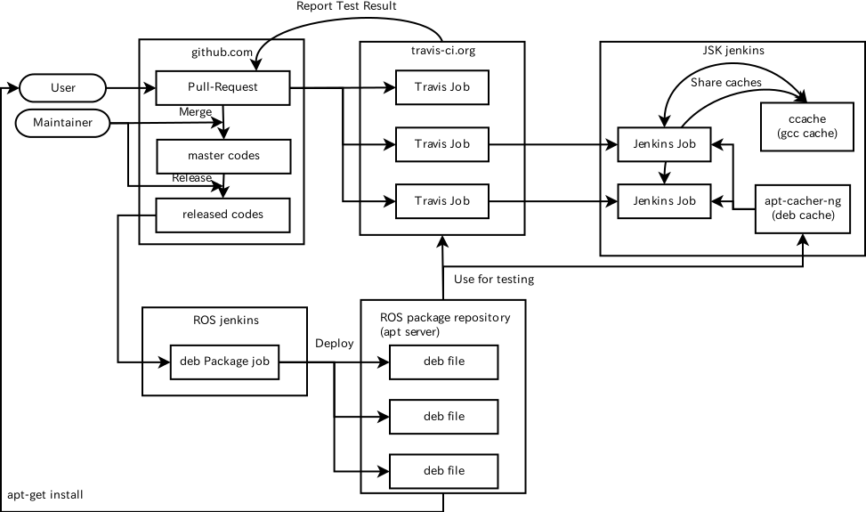

# jsk_travis

[](https://gitter.im/jsk-ros-pkg/jsk_travis?utm_source=badge&utm_medium=badge&utm_campaign=pr-badge&utm_content=badge)
[](https://travis-ci.org/jsk-ros-pkg/jsk_travis)



- How to update docker image on jenkins
```
echo -e "FROM ros-ubuntu:14.04\nRUN apt-get update\nRUN apt-get -y upgrade\nEXPOSE 22" | sudo docker build -t ros-ubuntu:14.04 -
```


----------------------------------------------------------

## Where test runs

jsk_travis is a package to test ROS repositories on travis and jenkins.
In order to test on hydro, it uses travis and on indigo and jade, it uses jenkins by default.
On travis, docker can be enabled to test multiple distribution.
Use `USE_DOCKER`, `USE_TRAVIS` and `USE_JENKINS` to configure them manually.
The jenkins server is available on [jenkins.jsk.imi.i.u-tokyo.ac.jp](https://jenkins.jsk.imi.i.u-tokyo.ac.jp:8080).


## Usage

jsk\_travis expects to be added to .travis as submodule.
```
git submodule add https://github.com/jsk-ros-pkg/jsk_travis.git .travis
```

And each project needs to setup .travis.yml for the travis.
[jsk_common's .travis.yml](https://github.com/jsk-ros-pkg/jsk_common/blob/master/.travis.yml) is a good example to setup
.travis.yml.

Note that jsk\_travis only supports being upgraded and PRs that downgrades jsk\_travis result in test fails.


## Restarting tests

see [this document](https://github.com/jsk-ros-pkg/jsk_common#restart-travis-from-slack)


## Environmental Variables

* `BEFORE_SCRIPT` (default: none)

  `BEFORE_SCRIPT` is used to specify shell commands which run before building packages.
  Some characters won't work without escaping it for xml on Jenkins.
  (see: [here](https://github.com/jsk-ros-pkg/jsk_travis/issues/171))

* `BUILD_PKGS` (default: none)

  You can specify the packages to build and test. If your repository has some troubles about several packages,
  you can ignore them by this option like `BUILD_PKGS="jsk_pcl_ros jsk_recognition_msgs"`.

* `EXTRA_DEB` (default: none)

  You can specify extra deb packages by `EXTRA_DEB` variable. The packages are installed before building packages.

* `ROS_DISTRO` (required)

  Specify your target distribution of ROS. Now we support hydro, indigo and jade.
  If you specify indigo or jade, tests automatically run on jenkins.

* `USE_DEB` (value: [`true`|`false`|`source`])

  If `false`, travis firstly sees [config files](#config-files) to resolve dependencies,
  and then installs left dependencies by apt.
  If `source`, travis does not sees [config files](#config-files) but runs `setup_upstream.sh` file.
  See [here](https://github.com/jsk-ros-pkg/jsk_roseus) for example.
  
* `USE_DOCKER` (default: `false`)

  Force to use docker on travis.

* `DOCKER_IMAGE_JENKINS` (defualt: `ros-ubuntu:$(lsb_release -sr)`)

  Docker image used in Jenkins.

* `DOCKER_RUN_OPTION` (default: `--rm`)

  Options passed to `docker run` if `USE_DOCKER` is `true`. Ignored otherwise.  
  **NOTE** If `--rm` is not set, the container remains even after job is finished. You must be responsible for removing it.

* `USE_JENKINS` (default: `false`)

  Force to run test on jenkins. jenkins server is more powerful than travis environment,
  so we can use jenkins to compile pcl-related packages such as
  [jsk_recognition](https://github.com/jsk-ros-pkg/jsk_recognition.git).
  This variable needs to be `true` to run test with
  [container-based travis environment](http://docs.travis-ci.com/user/workers/container-based-infrastructure/).
  This overwrites default configuration described [here](#where-test-runs).

* `USE_TRAVIS` (default: `false`)

  Force test run on travis. This overwrites default configuration described [here](#where-test-runs).

* `CATKIN_PARALLEL_TEST_JOBS` (default: `-p4`)

  The number of catkin parallel processes in test.

* `CATKIN_TOOLS_BUILD_OPTIONS`
  (default: `-iv --summarize --no-status` for `catkin-tools==0.3.X`
   and `--summarize --no-status` for `catkin-tools` of other version.)

  Options to be passed like `catkin build $CATKIN_TOOLS_BUILD_OPTIONS`.

* `CATKIN_TOOLS_CONFIG_OPTIONS` (default: none)

  Options to be passed like `catkin config $CATKIN_TOOLS_CONFIG_OPTIONS`.

* `ROS_PARALLEL_TEST_JOBS` (default: `-j8`)

  The number of make parallel processes in test.

* `ROSDEP_ADDITIONAL_OPTIONS` (default: `-n -q -r --ignore-src`)

  The options passed when rosdep install.

* `NOT_TEST_INSTALL` (none or `true`, default: none)

  Flag to skip testing catkin install in addition to devel build.

## Config Files

* `.travis.rosinstall`, `.travis.rosinstall.{{ ROS_DISTRO }}`

  If [`USE_DEB`](#environmental-variables) is `false`, `.travis.rosinstall` is used to generate ROS workspace.
  You can specify distribution by `.travis.rosinstall.{{ ROS_DISTRO }}` like `.travis.rosinstall.indigo`.


## Release Package

* relesing jsk_travis package is a bit tricky, due to existance of CATKIN_IGNORE file

```
mv CATKIN_IGNORE CATKIN_IGNORE.bak
catkin_generate_changelog
emacs -nw CHANGELOG.rst                 # prettify CHANGELOG so we can understand what has changed
git commit -m "update CHANGELOG" CHANGELOG.rst
catkin_prepare_release --no-push        # please type "Y" to all
mv CATKIN_IGNORE.bak CATKIN_IGNORE      # do not forget this
gitk                                    # make sure that what you changed is correct
git push && git push --tags
```


## Debug by changing the submodule jsk_travis

If you add jsk\_travis as a submodule,
it is difficult to make changes to have the travis test pass.
So in that case, I recommend you temporarily set your forked jsk\_travis as submodule.
The sample commmit is [here](https://github.com/jsk-ros-pkg/jsk_common/commit/eb8c2cf76edc01e074451f2028a0bc6a36582805).
